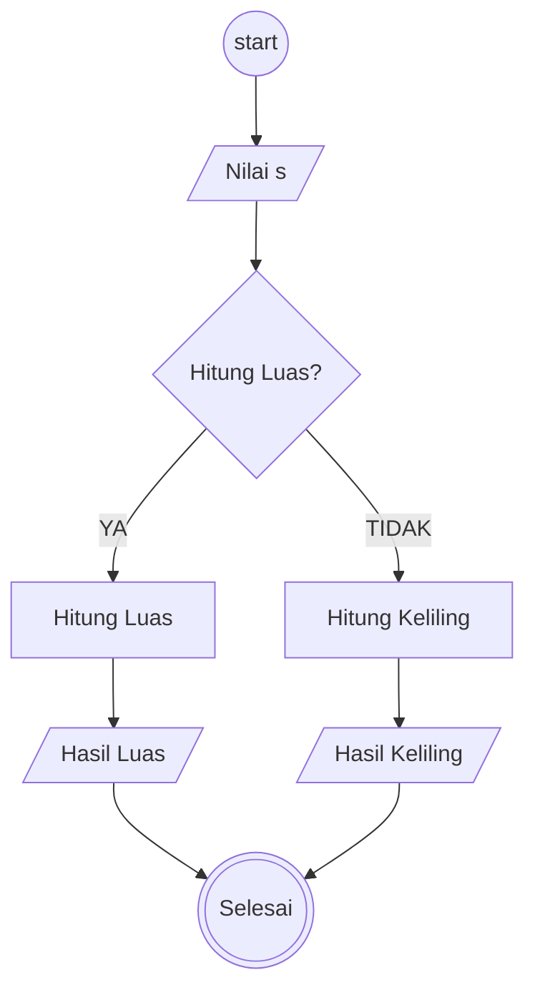

```mermaid
flowchart TB
start((start))
input1[/Nilai s/]
check1{Hitung Luas?}
hitung1[Hitung Luas]
hitung2[Hitung Keliling]
hasil1[/Hasil Luas/]
hasil2[/Hasil Keliling/]
selesai(((Selesai)))
start --> input1
input1 --> check1
check1 -- YA --> hitung1
check1 -- TIDAK --> hitung2
hitung1 --> hasil1
hitung2 --> hasil2
hasil1 --> selesai
hasil2 --> selesai
```